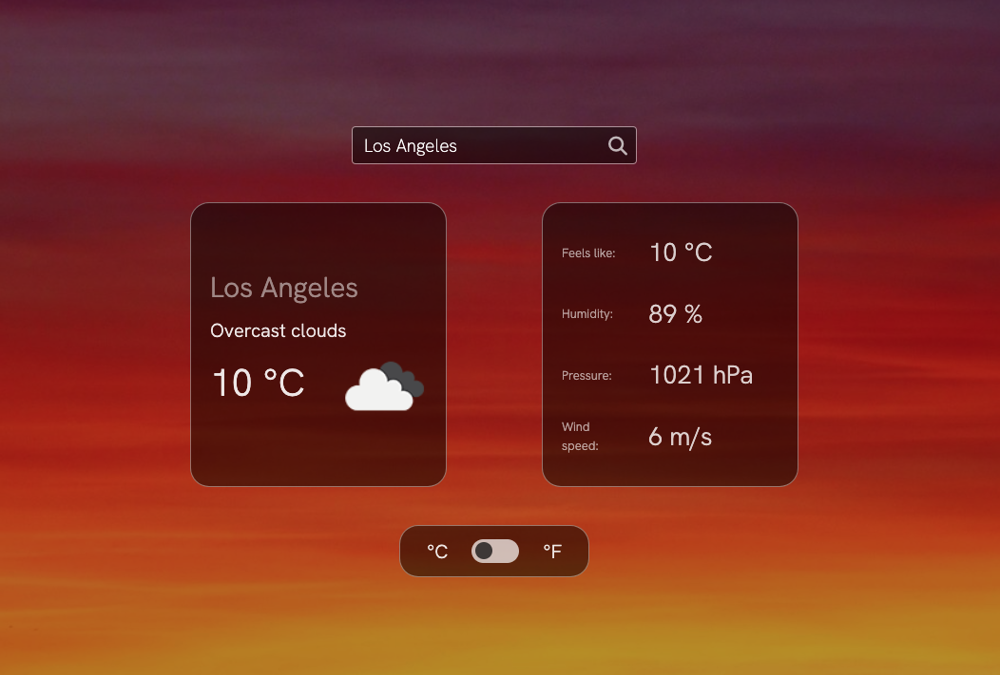

# Weather App

[Check live!](https://mrzadzinski.github.io/weather-app/)

Simple weather app.

## Features
* Type in desired city name
* Choose metric or imperial units

## Skills practiced
* Async JS
* Fetching and displaying data from external API

## Technologies
* Javascript
* SCSS
* HTML
* Webpack

## Acknowledgments
* This project was an assignment from The Odin Project course: [Weather App](https://www.theodinproject.com/lessons/node-path-javascript-weather-app)
* Special thanks to [openweathermap](https://openweathermap.org/api) for providing free key to their API